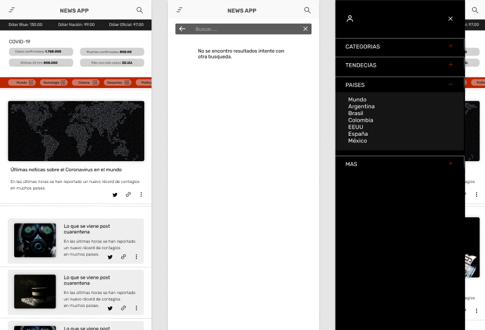

## Side Proyect NEWS APP with React and Redux 
[LIVE](https://www.demo.com)

---------------------------------

*Screenshots:*

--------------------------------
- Start Proyect:
`yarn add`

- Run Proyect:
`yarn start`

---
##### Tasks (First Mobile)
* [ ] NAVBAR
  * [ ] Menu Burger
  * [ ] Menu Mobile
  * [ ] Search
* [ ] HEADER
  * [ ] Section dolar (use dolars api)
  * [ ] Section covid-19 (use covid api)
* [ ] MAIN
  * [ ] Section Categories news api
  * [ ] List Items of the api news
  * [ ] Icons share

----------

*TECHNOLOGIES:*
`REACT`
`REACT-ROUTER-DOM`
`REDUX`
`REACT-REDUX`
`REDUX-THUNK`
`STYLED-COMPONENTS`

----
*API'S:*
[News]()
[Covid-10]()
[Dolar]()